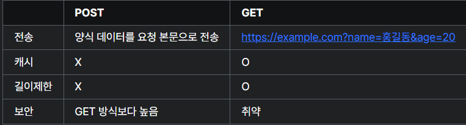

# 007 HTML

날짜: 2025/03/06
Subject: HTML
피드백 요청: No

## 📝 오늘 배운 내용 요약

1. form
    - 입력받기 위한 양식을 작성하는 태그.
    - `method` 양식을 제출할 때 사용할 메서드
    - get과 post 속성이 있음.
        
        
        
    - action
        - 양식 데이터를 처리할 프로그램의 url을 작성
    - autocomplete
        - 자동완성기능을 제어 on, off
2. input
    - input `<input name="", value="">`
        
        
        
    - type 속성 `<input type="">`
        
        
        
    - tex/ password/url/search/tel
        - `maxlength`: 최대 문자 수
        - `minlength`: 최소 문자 수
    - checkbox/radio
        - `checked`: 미리 선택된 상태로 표시
    - file
        - `ultiple`: 여러 개의 파일 선택 가능
    - number
        - `max`: 최대값
        - `min`: 최소값
        - `step`: 증가 단위
    - value
        - 사용자가 입력한 값 또는 기본값으로, 폼 제출 시 `name`과 함께 서버로 전송
3. label
    - **역할:**`input` 요소와 연결하여 접근성을 높여주는 태그.
    `for` 속성을 이용해 특정 `input`과 연결.
    - **주의사항:**
        - `label` 내부에 `a`나 `button` 등 다른 요소를 배치하지 않기
        - 제목이 필요한 경우는 `fieldset`과 `legend` 사용
4. select
    - **역할:**
    옵션 메뉴를 제공하는 태그
    - **구성 요소 및 속성:**
        - `<option>`: 개별 옵션 항목 (실제 전송되는 값은 `value`)
        - `<optgroup>`: 옵션들을 그룹화
        - `multiple`: 여러 항목 동시 선택 가능
        - `size`: 보이는 항목 수 지정
        - `required`: 필수 선택
        - `disabled`: 선택 불가 처리
5. fieldset
    - `fieldset`**:**
    관련된 입력 항목들을 그룹으로 묶어준다.
    - `legend`**:**
    그룹의 제목을 제공하는 태그
6. datalist
    - **역할:**`input` 요소에 따른 옵션 목록을 제공하여, `input`과 `select`의 기능을 결합한것.
7. 그 외
    - **Textarea:**
    텍스트박스를 제공하는 태그
        - **주요 속성:**`cols`, `rows`, `maxlength`, `minlength`, `placeholder`
    - **Button:**
    다양한 동작을 수행할 수 있는 버튼. 기본적인 `input` 태그와 유사하며, 이미지, 아이콘 또는 자바스크립트 활용도 가능.
        
        ```html
        <!-- Input 태그를 이용한 버튼 예시 -->
        <input type="button" value="버튼" />
        <input type="reset" value="초기화" />
        <input type="submit" value="전송" />
        
        <!-- Button 태그를 이용한 버튼 예시 -->
        <button type="button">버튼</button>
        <button type="reset">초기화</button>
        <button type="submit">전송
        ```
        
- 실습코드
    
    
    
    ```html
    <!DOCTYPE html>
    <html lang="ko-KR">
      <head>
        <meta charset="UTF-8" />
        <meta name="viewport" content="width=device-width, initial-scale=1.0" />
        <title></title>
        <style>
            .sr-only {
                position: absolute;
                width: 1px;
                height: 1px;
                padding: 0;
                margin: -1px;
                overflow: hidden;
                clip: rect(0, 0, 0, 0);
                white-space: nowrap;
                border: 0;
              }
        </style>
      </head>
      <body>
        <header>
            <h2>로그인 또는 회원가입</h2>
            <button>
                
                <span class="sr-only">닫기</span>
            </button>
        </header>
        <section>
            <h3 class="sr-only">로그인</h3>
            <p>위니브에서 여러분의 궁금증을 해결하세요! :)</p>
            <form>
                <input type="text" placeholder="아이디" name="id"/>
                <input type="password" placeholder="비밀번호" name="pw"/>
                <input type="checkbox"id=check name="keep">
                
                <label for="check">로그인 상태유지</label>
                <ul>
                    <li><a href="#">회원가입</a></li>
                    <li><a href="#">아이디/비밀번호 찾기</a></li>                
                </ul>
                <span>또는</span>
                <section>
                    <h3 class="sr-only">소셜로그인</h3>
                    <ul>
                        <li><a href="#" target="blank">구글 계정으로 로그인</a></li>
                        <li><a href="#" target="blank">페이스북 계정으로 로그인</a></li>
                        <li><a href="#" target="blank">네이버 계정으로 로그인</a></li>
                        <li><a href="#" target="blank">카카오 계정으로 로그인</a></li>
                    </ul>
                </section>
            </form>
        </section>
      </body>
    </html>
    ```
    
1. 접근성과 seo
    - **접근성:**
    사용자들이 웹사이트를 쉽게 사용할 수 있도록 돕는 기능. (예: 스크린 리더를 위한 `sr-only` 클래스 등)
    - **SEO (검색 엔진 최적화):**
    검색 엔진에서의 노출 및 접근성을 고려하는 기술로, 필요할 때 추가 학습 및 적용.

## 💭 오늘의 회고

1. **배운 점**
    - form, input, label, select, fieldset 등 입력 양식에 쓰이는 태그들
    - seo, 접근성
2. **어려운 점/개선할 점**
    - html은 태그 형식이라 실습처럼 화면을 보고 마크업을 하는게 기억에 오래 남는듯하다.