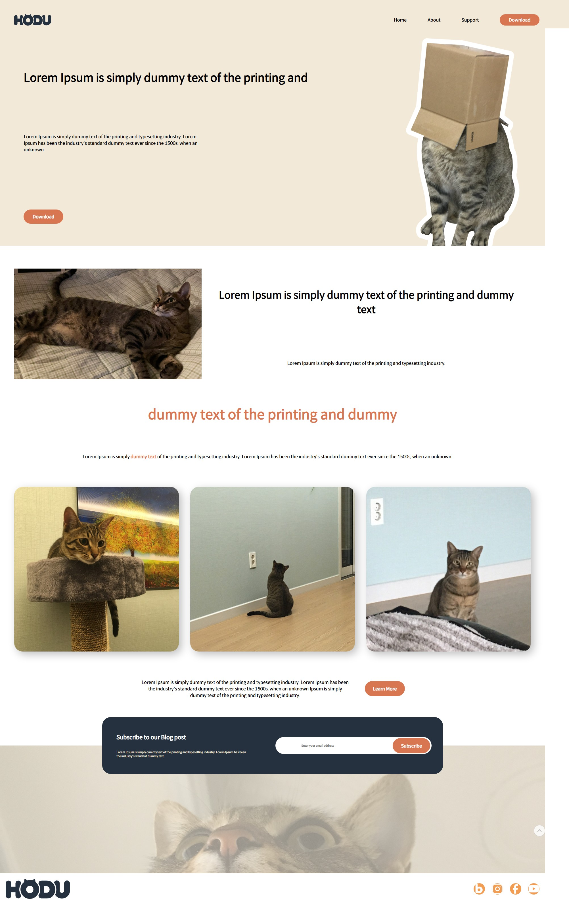
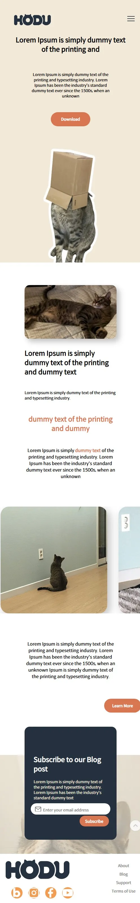
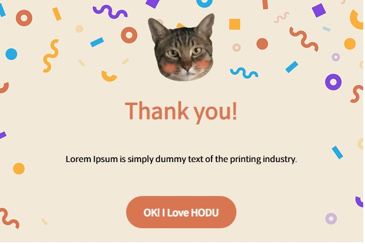
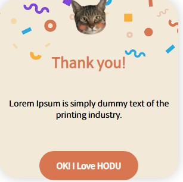
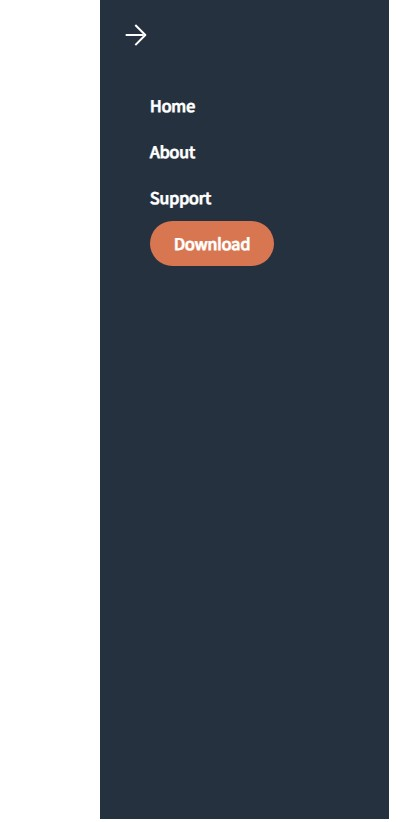

# 021 HTML&CSS Project 2

날짜: 2025/03/26
Subject: FE프로젝트
피드백 요청: No

# 랜딩페이지

## 📝 프로젝트 소개

HTML과 CSS를 사용하여 제작했습니다.

## 🛠️ 사용 기술

[](https://img.shields.io/badge/HTML5-E34F26?style=flat-square&logo=html5&logoColor=white)

[](https://img.shields.io/badge/CSS3-1572B6?style=flat-square&logo=css3&logoColor=white)

## ✨ 주요 기능

- 데스크탑 및 모바일 기기에 맞는 반응형 디자인
- CSS만을 활용한 인터랙티브 요소

## 🖼️ 스크린샷

# 데모페이지

[https://skoloks-10.github.io/estCamp_5th_project2/](https://skoloks-10.github.io/estCamp_5th_project2/)

# 전체페이지



# 모바일화면



# 모달전체화면



# 모달모바일화면



# 메뉴화면



## 📋 프로젝트 구조

```
/
├── index.html          # 메인 HTML 파일
├── css/
│   └── style.css       # 메인 스타일시트
├── images/             # 이미지
└── README.md           # 리드미 파일

```

## 🚀 실행 방법

1. `index.html`을 브라우저에서 열기
2. 또는 [깃허브 데모 페이지](https://skoloks-10.github.io/estCamp_5th_project2/) 방문하기
    
    https://github.com/skoloks-10/estCamp_5th_project2.git
    

## 🔮 향후 개선 사항

- JavaScript 기능 추가
- 접근성 기능 개선
- 더 많은 인터랙티브 요소 추가

## 👨‍💻 개발자

- [정승훈](https://github.com/skoloks-10)

## 📅 업데이트이력

- First - 2025-03-26 09:00:00 (UTC) : 초안 작성
- Ver.1 - 2025-03-26 22:30:00 (UTC) : 전체화면 html, css 구성
- Ver.2 - 2025-03-27 13:30:00 (UTC) : 반응형, 모달, 메뉴창 구성 및 연결